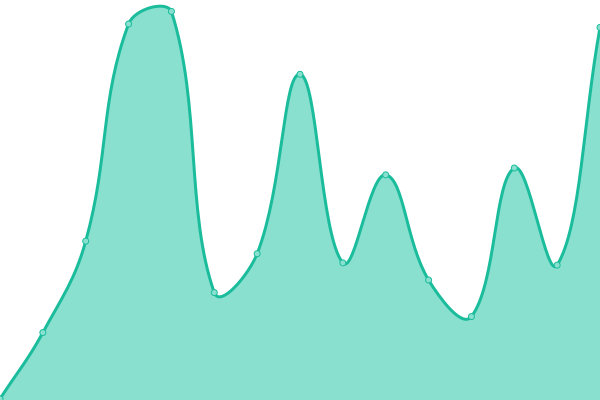

# [📈 Live Status](https://shadowdara.github.io/Pages-Uptime): <!--live status--> **🟧 Partial outage**

This repository contains the open-source uptime monitor and status page for [shadowdara](https://shadowdaragithub.io/Pages-Uptime), powered by [Upptime](https://github.com/upptime/upptime).

With [Upptime](https://upptime.js.org), you can get your own unlimited and free uptime monitor and status page, powered entirely by a GitHub repository. We use [Issues](https://github.com/shadowdara/Pages-Uptime/issues) as incident reports, [Actions](https://github.com/shadowdara/Pages-Uptime/actions) as uptime monitors, and [Pages](https://shadowdara.github.io/Pages-Uptime) for the status page.

<!--start: status pages-->
<!-- This summary is generated by Upptime (https://github.com/upptime/upptime) -->
<!-- Do not edit this manually, your changes will be overwritten -->
<!-- prettier-ignore -->
| URL | Status | History | Response Time | Uptime |
| --- | ------ | ------- | ------------- | ------ |
|  [Shadowdara - Vercel](https://shadowdara.vercel.app/) | 🟩 Up | [shadowdara-vercel.yml](https://github.com/ShadowDara/Pages-Uptime/commits/HEAD/history/shadowdara-vercel.yml) | 

 299ms
     
 | 

<a href="https://shadowdara.github.io/Pages-Uptime/history/shadowdara-vercel">100.00%</a>
    

|  [Repo Database Creator - Vercel](https://repo-database-creator.vercel.app/) | 🟩 Up | [repo-database-creator-vercel.yml](https://github.com/ShadowDara/Pages-Uptime/commits/HEAD/history/repo-database-creator-vercel.yml) | 

 187ms
     
 | 

<a href="https://shadowdara.github.io/Pages-Uptime/history/repo-database-creator-vercel">100.00%</a>
    

|  [Shadowdara - Infinityfree](https://shadowdara.42web.io/) | 🟥 Down | [shadowdara-infinityfree.yml](https://github.com/ShadowDara/Pages-Uptime/commits/HEAD/history/shadowdara-infinityfree.yml) | 

 0ms
     
 | 

<a href="https://shadowdara.github.io/Pages-Uptime/history/shadowdara-infinityfree">0.04%</a>
    

|  [github](https://github.com) | 🟩 Up | [github.yml](https://github.com/ShadowDara/Pages-Uptime/commits/HEAD/history/github.yml) | 

 68ms
     
 | 

<a href="https://shadowdara.github.io/Pages-Uptime/history/github">100.00%</a>
    

<!--end: status pages-->

[**Visit our status website →**](https://shadowdara.github.io/Pages-Uptime)

## 📄 License

- Powered by: [Upptime](https://github.com/upptime/upptime)
- Code: [MIT](./LICENSE) © [Anand Chowdhary](https://anandchowdhary.com), supported by [Pabio](https://pabio.com)
- Data in the `./history` directory: [Open Database License](https://opendatacommons.org/licenses/odbl/1-0/)
